# ZJ
# 智能组卷系统  
### 页面采用spring的thymeleaf  
### 技术栈springboot+springmvc+mybatis+pageHepler（分页插件）  
## 下面项目部分截图 
--- 
### 首页  
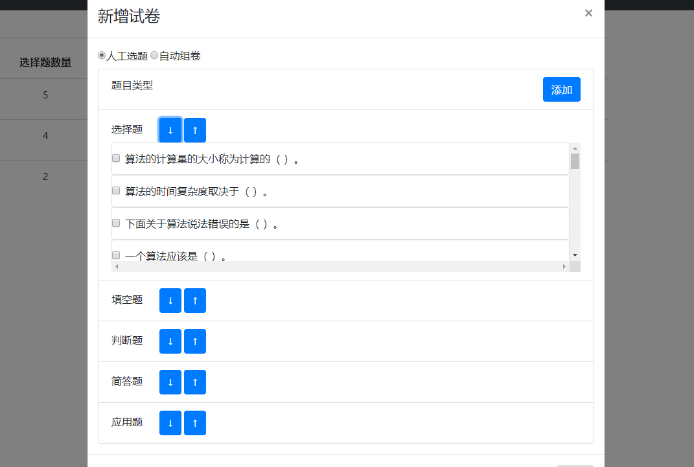  
---
### 新增试卷-自动组卷  
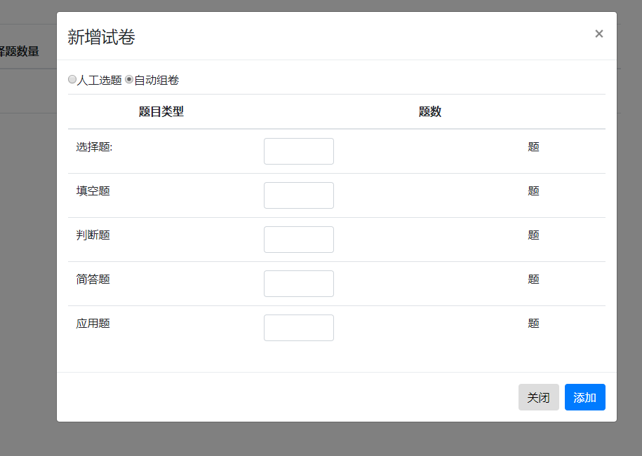  
---  
### 新增试卷-人工组卷  
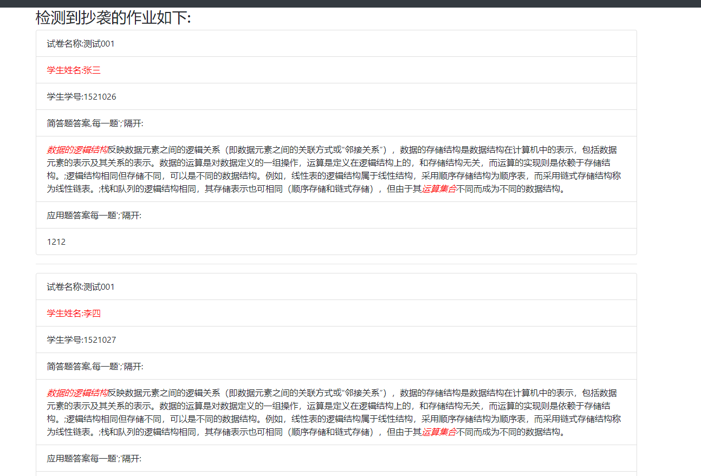    
---
### 作业列表  
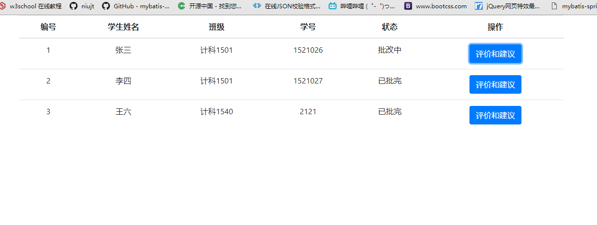
---
### 学生-评价和建议      
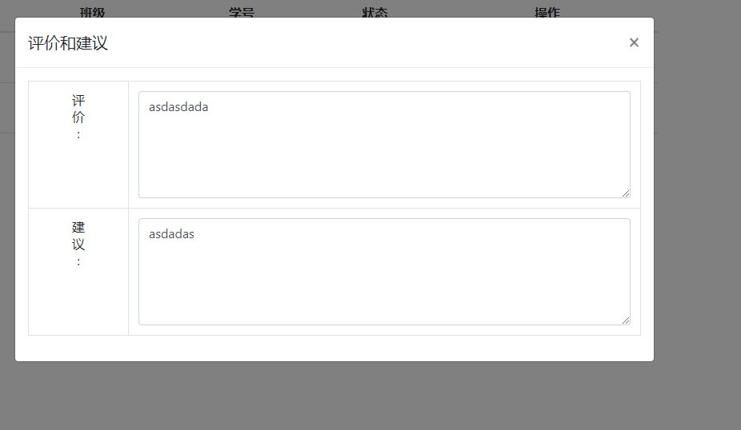 
---
### 学生-作业查看     
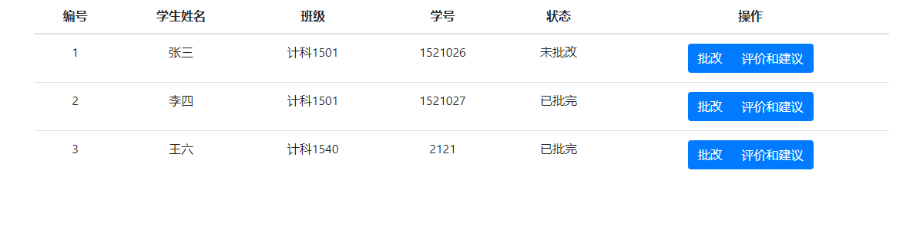   
### 老师-作业批改    
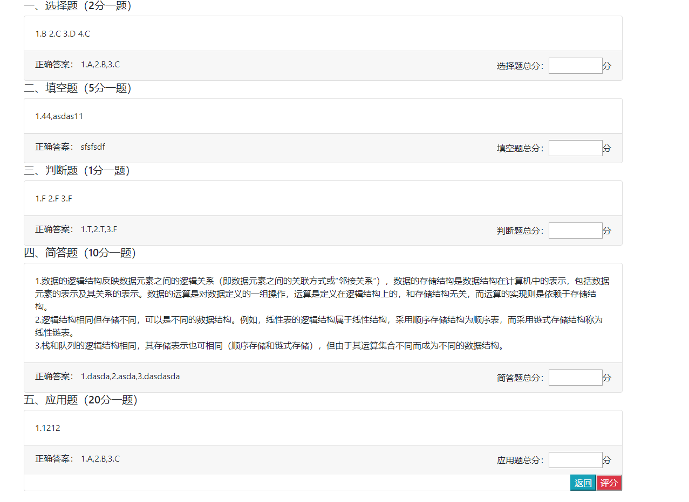  
---
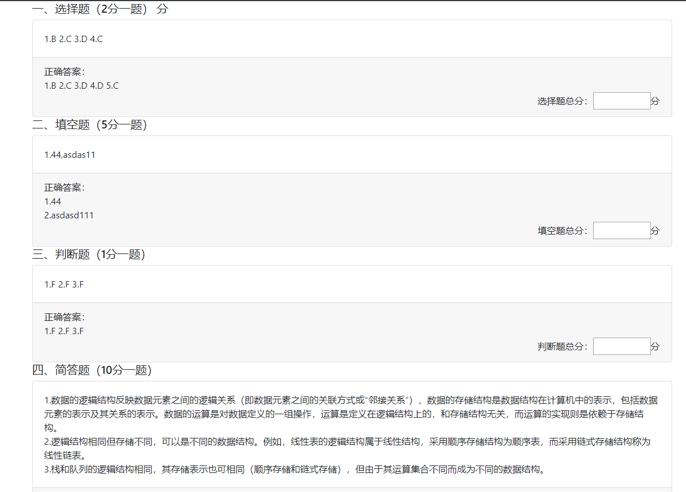  
---
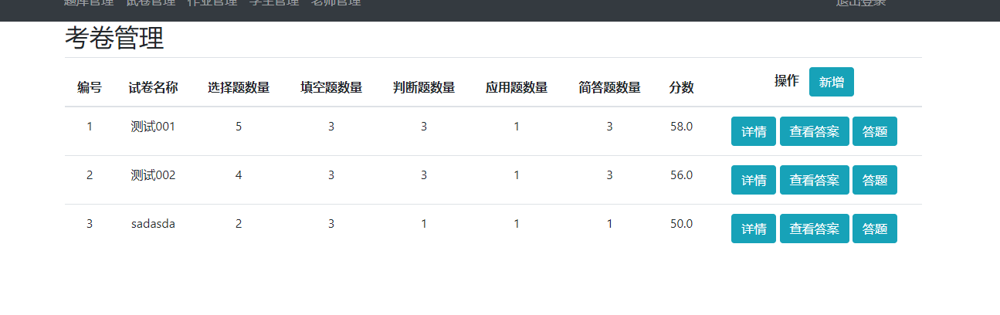  
---
### 考卷管理   
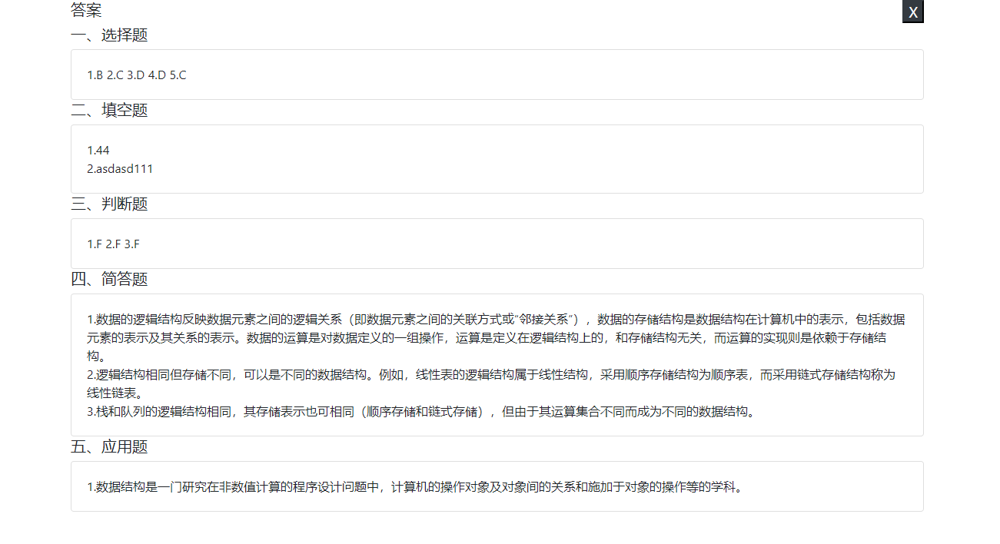  
---
### 考卷答案
  
----
### 登录
  
---
  
---
### 注册
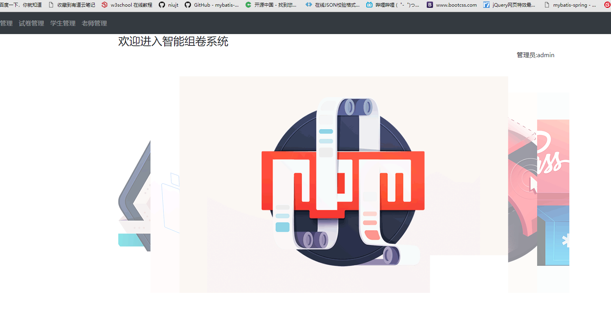   

   
